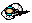
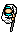

# Типы врагов в игре

### Солдат с огнестрелом

- Данный солдат может как патрулировать территорию, так и контролировать одну позицию.
- Солдат имеет оружие дальнего действия. При обнаружении игрока, данный враг начинает скорое движение в его сторону. Останавливаясь недалеко от игрока, солдат начинает ведение огня.

### Солдат с монтировкой

- Данный солдат, как и прошлый, может как контролировать одну позицию, так и вести патрулирование.
- Солдат имеет оружие ближнего действия. Солдат начинает преследование игрока, и атакует на очень близком расстоянии. Есть шанс убежать от данного типа врага без полученного урона.

### Все типы врагов, при потере игрока из поля зрения, продолжают движение на место, где был игрок в момент выхода из поля зрения.
