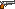

# Типы оружий в игре

### Все оружия в игре делятся на два типа: Ближнего и дальнего боя

## Ближний бой

- Монтировка 
- Бита 

## Дальний бой
- Узи 
- Револьвер 

### Особенности оружия
- Оружия ближнего боя могут наносить урон только по противникам, находящимся перед игроком на близком расстоянии.
- Узи стреляет очередями по 3 патрона, когда как револьвер может выпустить за один раз только один патрон.
- Патроны, выпускаемые Узи, наносят меньше урона, чем патроны револьвера.
- Урон у оружий ближнего боя одинаковый. Различия только в внешнем виде.